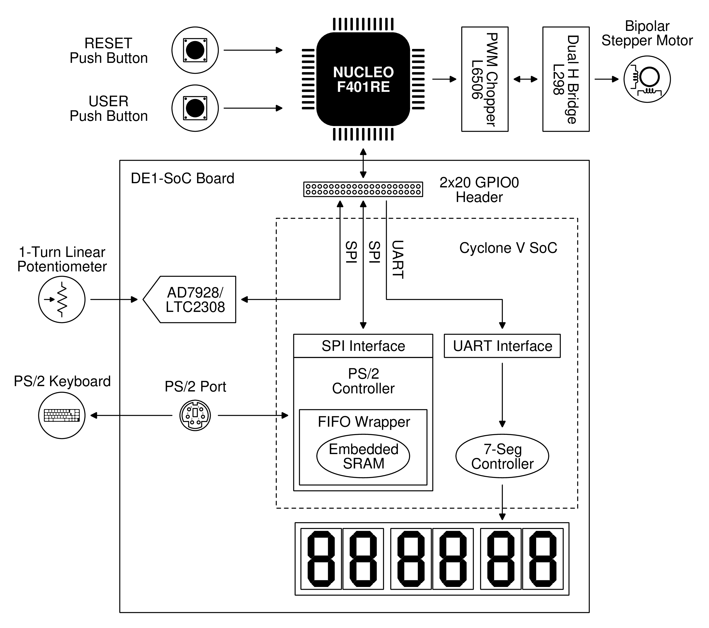

# An Unnecessarily Complex FPGA/MCU Stepper Motor Controller

The project scratches the itch of designing a full system from the ground up, from the hardware synthesized on an FPGA or put together on a perfboard, up to the software abstractions that run on an MCU.


While trying my hand at digital verification with SystemVerilog and the UVM (Universal Verification Methodology) in past projects, I fell in love with the language: here I chose it also for hardware modeling. The key blocks of the design are verified to some extent: there is no formal verification plan, no functional or code coverage, but the DUTs are exercised with some random stimuli against abstract golden models written with SystemVerilog's verification constructs.

*What could be salvaged for some future projects* ?

- A parameterized UAR(T) core, with clock synchronization on all transitions
- A parameterized SPI slave controller, operating in the clock domain of the master's clock
- A PS/2 controller, supporting bidirectional communication and detection of communication errors

In the same vein, the firmware is developed from scratch in C++ and is structured with CMake.
Considering the amount of I/O peripherals involved in the project, I really wanted to adopt the UNIX approach of virtualizing them as files, so that I would be able to operate through the _cstdio_ library functions.

Additional information can be found under [doc/](doc/). The design of the [perfboard](doc/motor_bd.vrt) is in [VeroRoute](https://sourceforge.net/projects/veroroute/ "Qt based Veroboard, Perfboard, and PCB layout and routing application") format.

## Theory of Operation

The system implements an interface to program the movement pattern for a bipolar stepper motor and execute it on demand. The pattern is committed to non-volatile storage and consists of a sequence of data points, each representing a circular motion segment defined by angular velocity and displacement. During execution, the data points are retrieved in a circular fashion from memory, and are converted into motor-driving stimuli.



The interface is operated as follows:

- The movement pattern is cleared by pressing and holding the user push button for at least 1 s. Successful clearing is acknowledged by displaying *CLEAr* on the 7-segment displays.

- Data points are entered using the linear potentiometer and the PS/2 keyboard. The potentiometer sets the angular velocity in the range [2.5, 400] rpm, while the angular displacement is specified in degrees with the keyboard, according to the regex pattern `[+-]?[0-9]{1,3}(.[0-9])?`. The sign defaults to `+` if omitted, which corresponds to a counterclockwise rotation. When the input operation begins, triggered by pressing some keys, the 7-segment displays change to *InPUt*. The operation is terminated by pressing the return or enter keys, upon which data is validated, and the potentiometer output is converted. The outcome is notified as: *Err-2 bAd PAttErn*, if the parsing of the keyboard input failed; *Err-3 FuLL*, if the maximum number of data points have already been entered. Otherwise, if no error has occurred, the data point is displayed in the format below, where the data point number starts at zero, the angular velocity is expressed in revolutions per minute, and the angular displacement in degrees.

<p align="center">
  [&ltdata point number&gt] &ltangular velocity&gt &ltangular displacement&gt
</p>

- The execution of a valid movement pattern, that is, one containing at least one data point, begins by pressing the user push button. An empty pattern results in the display of *Err-1 no dAtA*, while a valid pattern displays *PLAy*. The execution continues until the push button is pressed again, after which the displays revert to printing *IdLE*.

## Compiling the Projects

The project makes use of submodules, make sure to clone recursively:

```bash
git clone --recurse-submodules https://github.com/fscatox/efes_prj.git
```

The synthesis and optimization flow for the DE1-SoC platform is run in [Quartus Prime](https://www.intel.com/content/www/us/en/products/details/fpga/development-tools/quartus-prime.html "FPGA Design Software - Quartus Prime"). The programming SRAM object file is generated by executing the [`fpga/run.sh`](fpga/run.sh) script.

The firmware image is built with CMake:

```bash
cmake -DCMAKE_BUILD_TYPE=Release -S ./fw -B ./fw/cmake-build-release
cmake --build ./fw/cmake-build-release
```
